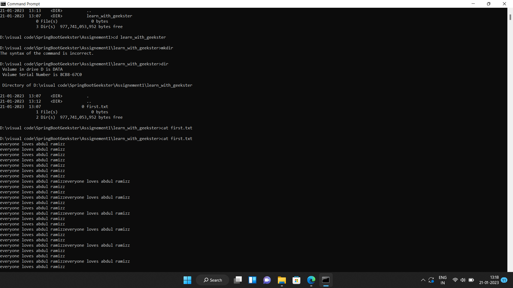

# Springbootassignement1
Create a folder called learn_with_geekster.
cd into the learn_with_geekster folder.
Create a file called first.txt.
Display the file content in terminal.
Configure your name and your email

